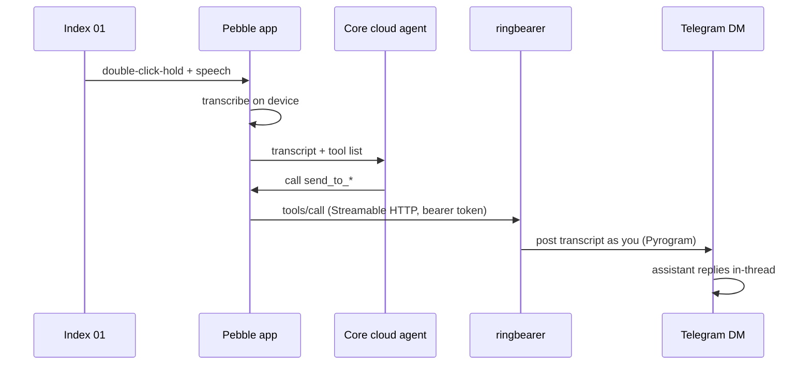

# ringbearer

> *One does not simply type.*

 

Turn the **Pebble Index 01 ring** into a push-to-talk button for your own AI
assistant, using its Telegram DM as the conversation surface.

Double-click-hold the ring and speak. The Pebble app transcribes, its MCP
sandbox agent calls this bridge's one tool, and the bridge posts your words
into your existing Telegram DM with the assistant — **as you, from your own
Telegram account**. The assistant sees a normal message in a thread it already
knows, replies with full context, and the whole exchange stays auditable in
Telegram like any other conversation. Start something from the ring on a walk,
finish it on your phone later.

Works with any assistant that lives in a Telegram chat: Hermes, OpenClaw, a
bot you wrote yourself. One Python file — FastAPI, the MCP SDK, Pyrogram.

## How it works



The bridge exposes exactly **one MCP tool** — `send_to_<assistant>` — whose
description tells the app's agent to relay every message verbatim and never
answer itself. Your assistant's actual capabilities are never exposed to the
app's cloud; it just gets a pipe.

## Quick start

```bash
git clone https://github.com/MDB4241/ringbearer && cd ringbearer
python3 -m venv .venv && .venv/bin/pip install -r requirements.txt
.venv/bin/python ringbearer.py
```

That last command is the whole onboarding, one loop: it generates your bearer
token, walks you to [my.telegram.org/apps](https://my.telegram.org/apps) for
API credentials, asks which chat your assistant lives in and where to listen,
writes `.env` (mode 600), logs you into Telegram (one-time), and starts the
server — finishing with the exact settings to paste into the Pebble app. Run
it again any time: it resumes from whatever state exists, which after first
run just means "start the server."

That first server runs in your terminal on purpose — test the ring against it
and watch the tool calls log live. When you're satisfied, Ctrl-C it and
graduate to a real service (next section); the first run prints those exact
steps too.

The pieces also exist standalone when you need one — `ringbearer.py setup`,
`ringbearer.py login` (e.g. after a session revocation), `ringbearer.py run`
(non-interactive by design, so a service manager can never hang on a prompt),
and `ringbearer.py probe`.

A note on Python versions: tested on 3.13. The Telegram layer, `pyrogram`
2.0.106, is its author's final release and only declares support through
3.11 — `ringbearer.py` carries a small event-loop guard that keeps it working on
newer interpreters, but future breakage there is possible.

Verify without touching your real DM:

```bash
.venv/bin/python ringbearer.py probe           # dry run — exercises auth + MCP + logging
.venv/bin/python ringbearer.py probe --live    # actually sends one real message
```

`probe` connects exactly like the phone would (same transport, same auth), so
it bisects failures: probe succeeds → fix your phone settings; probe fails →
fix server, network, or token. Set `BRIDGE_URL` to probe a remote install.

## Phone settings (Pebble app)

Under Index settings → MCP servers:

- **URL:** `http://<host>:8787/ringbearer/mcp` — transport **Streamable**
- **Header:** `Authorization: Bearer <BRIDGE_TOKEN>`
- **Server name: no spaces.** The app sanitizes names for the LLM but
  dispatches tool calls on the original name, so a space breaks the round trip
  with "Invalid tool call" (reported upstream).
- Sandbox group **model type: Default** — the "Index Agent" type ignores
  custom MCP servers.
- Then **Secondary Mode → MCP Sandbox** → select the server group (the OK
  button stays disabled until a group is picked).

## Running it as a service (macOS)

[`ringbearer.plist.example`](ringbearer.plist.example) is a launchd user-agent
template — it just runs `ringbearer.py run` (host and port come from `.env`), so
the only thing to edit is your checkout path. Create the log directory first
(`mkdir -p logs` — launchd won't create it), then copy to
`~/Library/LaunchAgents/` and `launchctl load`.

Two macOS traps it already accounts for:

- The checkout must **not** live under `~/Documents`, `~/Desktop`, or
  `~/Downloads` — TCC blocks launchd agents from reading those.
- Pyrogram anchors its session file to the *launching script's* directory
  (`.venv/bin` under uvicorn); `ringbearer.py` pins `workdir` to its own directory
  so the session `login` writes is the one the server finds.

## Security notes

- **Your words pass through Pebble's cloud.** The phone transcribes on device,
  but the transcript goes to the app's cloud agent so it can decide to call
  this tool. The bridge is the last hop, not the only one — see the diagram
  above. (A direct webhook mode, [#313](https://github.com/coredevices/mobileapp/issues/313),
  would remove that hop.)
- **Bind deliberately.** Prefer a [Tailscale](https://tailscale.com) address so
  the bridge is reachable from anywhere but never exposed to the LAN or
  internet; WireGuard makes plain HTTP acceptable inside the tailnet. Never
  port-forward this.
- **The bearer token is the gate.** Everything except `/healthz` requires it;
  the server refuses to start without one. Comparison is constant-time.
- **The session file is your Telegram account.** `*.session` is gitignored;
  treat it like a password. One process per session file — a second client on
  the same session risks `AUTH_KEY_DUPLICATED` and revocation.
- **Probes are dry-run by default.** A live probe is a real message your real
  assistant will act on; `--live` is a deliberate flag for that reason.
- **Captures are also logged locally.** Every transcript is appended verbatim
  to `captures.jsonl` (created mode 600, gitignored, never rotated) — it's the
  local record that survives even if Telegram delivery fails. Delete it
  whenever you like.

## Design notes

This is, truthfully, webhook functionality built on MCP. The app's own webhook
mode runs a full agent turn and files every capture as a note, so the MCP
sandbox is the clean path today. There's an upstream feature request for a
direct webhook-only mode
([coredevices/mobileapp#313](https://github.com/coredevices/mobileapp/issues/313));
if it lands, this gets even simpler.

## Configuration

All via `.env` (see [`.env.example`](.env.example)):

| Variable | Meaning |
|---|---|
| `BRIDGE_TOKEN` | Bearer token the phone must send (setup generates one) |
| `TELEGRAM_ENABLED` | `true` to actually deliver; `false` = log-only mode |
| `ASSISTANT_CHAT` | `@botusername` or chat id of the assistant DM |
| `ASSISTANT_NAME` | Display name; becomes the tool name (`Hermes` → `send_to_hermes`) |
| `TG_API_ID` / `TG_API_HASH` | Telegram API credentials (my.telegram.org) |
| `BIND_HOST` / `BIND_PORT` | Listen address — the IP your phone can reach (default port `8787`) |
| `SESSION_NAME` | Pyrogram session file name (default `ringbearer`) |
| `RING_PREFIX` | Prefix on relayed messages (default 🎤) |
| `MCP_MOUNT` | Mount path; endpoint is `<MCP_MOUNT>/mcp` (default `/bridge`) |

## License

[MIT](LICENSE)
