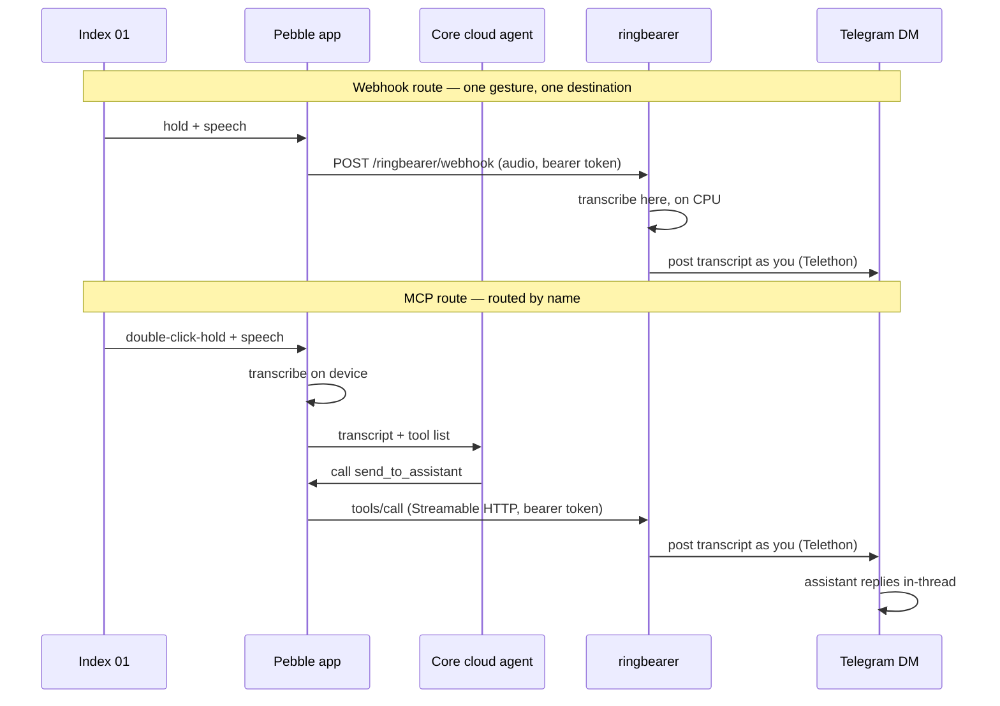

# ringbearer

> *One does not simply type.*

 

Turn the **Pebble Index 01 ring** into a push-to-talk button for your own AI
assistant, using its Telegram DM as the conversation surface.

Hold the ring and speak. The bridge posts your words into your existing
Telegram DM with the assistant — **as you, from your own Telegram account**.
The assistant sees a normal message in a thread it already knows and replies
with full context. Optional per-capture topics start a fresh context instead.
Either way the whole exchange stays auditable in Telegram like any other
conversation. Start something from the ring on a walk, finish it on your phone
later.

The capture reaches the bridge one of two ways, and you can run either or both:

- **The webhook route.** The phone posts the recording straight to your
  machine and the bridge makes the text here. Nothing else is in the path: no
  cloud agent, no tool call, no LLM deciding whether to relay you. One gesture,
  one destination, and the faster of the two.
- **The MCP route.** The phone's cloud agent calls this bridge's one tool. That
  costs an agent turn, and it buys what the webhook cannot do: several
  assistants, addressed by name out loud ("ask plutus…"), and a reply in the
  phone's own feed.

Works with any assistant that lives in a Telegram chat: Hermes, OpenClaw, a
bot you wrote yourself. One small Python package — FastAPI, the MCP SDK,
Telethon, faster-whisper.

## How it works



Both routes end in the same function: it delivers the capture, logs it
verbatim to `captures.jsonl`, and answers within a bounded time whether
Telegram cooperated or not.

The MCP route exposes exactly **one tool** — `send_to_assistant` — whose
description tells the app's agent to relay every message verbatim and never
answer itself. Your assistant's actual capabilities are never exposed to the
app's cloud; it just gets a pipe. The webhook route exposes no tool at all: its
destination is configuration, and the words are never read to choose it.

## Quick start

```bash
git clone https://github.com/MDB4241/ringbearer && cd ringbearer
python3 -m venv .venv && .venv/bin/pip install -r requirements.txt
.venv/bin/python ringbearer.py
```

That last command is the whole onboarding, one loop: it generates your bearer
token, walks you to [my.telegram.org/apps](https://my.telegram.org/apps) for
API credentials, asks which chat your assistant lives in and where to listen,
asks whether you have more than one assistant, writes `.env` (mode 600), logs
you into Telegram (one-time), and starts the server — finishing with the exact
settings to paste into the Pebble app. Run it again any time: it resumes from
whatever state exists, which after first run just means "start the server."

The assistant question is the one that decides your routes. One assistant needs
only the webhook, so that is the only card you are handed. Several assistants
add the MCP route, and you get both cards.

That first server runs in your terminal on purpose — test the ring against it
and watch the captures log live. When you're satisfied, Ctrl-C it and graduate
to a real service (below); the first run prints those exact steps too.

The pieces also exist standalone when you need one — `ringbearer.py setup`,
`ringbearer.py login` (e.g. after a session revocation), `ringbearer.py run`
(non-interactive by design, so a service manager can never hang on a prompt),
and `ringbearer.py probe`.

A note on Python versions: needs 3.10+, tested on 3.14. The Telegram layer is
[Telethon](https://docs.telethon.dev), pinned exact — its stable 1.x line has
been continuously maintained for about a decade (development now lives on
[Codeberg](https://codeberg.org/Lonami/Telethon); the archived GitHub repo is
a move, not an ending).

Verify without touching your real DM:

```bash
.venv/bin/python ringbearer.py probe           # dry run — every configured route
.venv/bin/python ringbearer.py probe --live    # one real message per route
```

`probe` talks to each route the way the phone does: a `tools/call` over the same
transport for the MCP route, the app's own multipart body for the webhook
route. So it bisects failures: probe succeeds → fix your phone settings; probe
fails → fix server, network, or token. Set `BRIDGE_URL` to probe a remote
install (point it at that install's `<MCP_MOUNT>/mcp`; the webhook URL comes
from the same base). The probe builds its token from the local config — if the
target runs different settings, point `RINGBEARER_STATE_DIR` at that install's
state directory too.

There is also an offline test suite covering both routes, the delivery dials,
and the fail-closed topic path — `.venv/bin/python -m unittest` — no network,
no Telegram account, no model involved.

## Phone settings (Pebble app)

`setup` prints these with your own address and token filled in, and `run`
reprints them at every start. This is what they say.

### The webhook route

Two halves, and the app tells you about neither. "Webhook only" is a *routing*
choice; the URL and headers live in a separate per-gesture webhook config that
fires under every destination except "Nothing".

1. In the button switchboard, route a recording gesture — **Hold & Talk** or
   **Double click & hold** — to **Webhook only**.
2. Open **that same gesture's** Webhook settings and save:
   - **URL:** `http://<host>:8787/ringbearer/webhook`
   - **Header:** `Authorization: Bearer <BRIDGE_TOKEN>`
   - **Payload mode:** "Recording only" is the app's default and the one this
     was built for — the phone sends the audio and the bridge makes the text.
     "Both" and "Transcription only" send the phone's own transcript instead,
     which the bridge relays as-is.

The route alone sends nothing — no saved config, no request — and a saved
config alone keeps firing under whatever else that gesture does. **On every
gesture you leave on MCP sandbox, turn "Also send to webhook" off**: one left on
delivers the same capture twice, once through each route. If you upgraded from
an older app version, check both recording gestures — the migration copies a
single legacy webhook onto both of them.

**Send test event**, in those same webhook settings, is the safe first check.
The bridge answers 200, logs the event, and forwards nothing to any assistant.
It uses the draft URL and headers, so the endpoint is provable before you save
anything.

### The MCP route

Under Index settings → MCP servers:

- **URL:** `http://<host>:8787/ringbearer/mcp` — transport **Streamable**
- **Header:** `Authorization: Bearer <BRIDGE_TOKEN>`
- **Server name: no spaces.** The app sanitizes names for the LLM but
  dispatches tool calls on the original name, so a space breaks the round trip
  with "Invalid tool call" (reported upstream).
- Sandbox group **model type: Default** — the "Index Agent" type ignores
  custom MCP servers.
- Then **Secondary Mode → MCP Sandbox** → select the server group (the OK
  button stays disabled until a group is picked).
- **Also send to webhook: off**, for the reason above.

## Transcription

On the webhook route with payload mode "Recording only", the phone sends audio
and the text is made on this machine by
[faster-whisper](https://github.com/SYSTRAN/faster-whisper), on CPU, int8. No
API key, no cloud, no ffmpeg binary. It runs in a single worker thread, one
capture at a time, so `/healthz` and the MCP route never wait behind a decode —
and inside the Docker image it is CPU work like everything else in the
container.

`TRANSCRIBE_MODEL` picks the model (default `base.en`; `small.en` is slower and
sharper). The weights are downloaded on first start, not at build time, and
cached in `models/` under the state directory, so a rebuilt container does not
fetch them again. `TRANSCRIBE_MODEL=off` turns the whole thing off, for an
install whose phone always sends a transcript.

Audio is a temp file for exactly as long as the decode takes: written under the
state directory, deleted on success and on every failure path, and never
written into `captures.jsonl`, which records how many bytes arrived and nothing
else.

`/healthz` carries the numbers:

```json
{"transcribe": {"engine": "faster-whisper", "model": "base.en", "state": "ready",
                "last_ms": 354, "median_ms": 361, "error": null}}
```

`state` is `loading`, `ready`, `error`, or `disabled`. A capture that arrives
before the model is ready queues behind it in the same thread.

Two more things about the webhook route. Captures are deduplicated on the
recording's filename, because the app's own dedupe lives in memory and is empty
after a restart. And the route never redirects — `/ringbearer/webhook` and
`/ringbearer/webhook/` both answer directly, because the app follows a 301/302
on a POST and re-sends the entire body.

## Routes

`ROUTES` says which doors you use:

```env
ROUTES=webhook          # or: mcp, or: webhook,mcp
```

It shapes what `setup` and `run` print and what `probe` probes, so a
one-assistant install is never handed MCP settings it will never paste into the
phone. It is a declaration, not a switch: both endpoints are served either way,
and leaving it unset means both — which is what every install written before
this key has.

## Delivery modes

By default the bridge posts into the ongoing DM conversation: the assistant
sees a normal message in a thread it already knows and replies with full
context. Start something from the ring on a walk, finish it on your phone.

Set `NEW_TOPIC_PER_CAPTURE=true` to create a fresh Telegram topic for every
capture instead — useful for assistants such as Hermes that keep separate
context per topic. The tradeoff: each capture starts a clean conversation,
so the ring only ever opens threads. Follow-ups happen from your phone,
inside the topic the assistant replied in.

Topic mode has Telegram prerequisites — private-chat topics are a Bot API
9.4 feature, off by default. In [@BotFather](https://t.me/BotFather), enable
**Threaded Mode** on your assistant's bot (Bot Settings → Threads Settings)
and keep "users can create topics" allowed. Then in the DM chat itself, tap
the bot's name and flip the **Topics** toggle — it only appears after the
BotFather change (restart Telegram if you don't see it). Topic creation
fails closed: ringbearer logs the capture instead of silently sending it to
another topic.

### One-shot ring context

Normal chat assumes the user can read a reply and answer a follow-up question.
That assumption is wrong when they are walking around speaking into a ring. Set:

```env
DELIVERY_CONTEXT=one_shot
```

Ringbearer then wraps the verbatim transcript in a short recipient-side
instruction explaining that the user may not see the reply. An actionable
request is treated as authorization to act now: the assistant should not ask
for confirmation, should resolve minor ambiguity with reasonable low-risk
defaults, and should report the result briefly. If essential information is
missing, or an action would be materially unsafe or irreversible, it should
leave a concise blocker rather than inventing details or waiting for a live
answer.

The default is `conversation`, which preserves the historical message shape
and normal back-and-forth behaviour. This setting changes only what the target
assistant receives. Captures remain logged verbatim, topic titles still use
the raw transcript, and the Pebble cloud agent remains a relay rather than an
executor.

### Per-route dials

Both settings above are install-wide defaults, and either can be overridden for
one route alone:

```env
WEBHOOK_TOPIC_PER_CAPTURE=true      # webhook captures open their own topic
WEBHOOK_DELIVERY_CONTEXT=one_shot   # …and arrive as one-shot instructions
MCP_TOPIC_PER_CAPTURE=false         # the same two knobs, for the MCP route
MCP_DELIVERY_CONTEXT=conversation
```

An unset key means "use the global", so nothing changes until you set one, and
setting one never moves the other route. The reason to bother: the webhook
route is something you speak at and walk away from, which is what `one_shot` is
for, while the MCP route is a conversation you came back to.

## Multiple assistants

One bridge can carry to more than one assistant. Map the extras in `.env`
(`setup` collects them if you say you have more than one):

```
ASSISTANTS=plutus:@plutus_bot,quartermaster:@qm_bot
```

Each entry is `name:chat` — the name a short lowercase token, the chat the
same forms as `ASSISTANT_CHAT`. With any mapping present, the MCP route's tool
grows an optional `assistant` argument whose schema lists every valid name (the
default assistant included), so the app's agent learns the roster the moment
it connects — nothing to configure on the phone, ever. Say "ask plutus to
check my portfolio" and the capture routes to that chat; say nothing and it
goes to the default.

An unknown name is refused with the valid list, and the capture still lands
in `captures.jsonl` — words are never silently re-routed to a chat you
didn't address. Every mapped chat is verified at startup, and topic mode
applies to all of them: each mapped bot needs the prerequisites above.

The webhook route does not route by name and never will: it carries no routing
information, and reading the words to invent some would mean an assistant
chosen by whatever you happened to say. Its destination is `WEBHOOK_ASSISTANT`,
a roster name, defaulting to your default assistant. Say "hey plutus" into a
webhook gesture and it still goes where that setting points.

Test a mapping without the ring:

```bash
.venv/bin/python ringbearer.py probe --assistant plutus
```

Without `ASSISTANTS` set, none of this exists — the tool keeps its single
`message` argument.

## Running it as a service (macOS)

```bash
.venv/bin/python ringbearer.py service            # install + start the launchd agent
.venv/bin/python ringbearer.py service uninstall  # stop + remove it
```

`service` writes the plist with your real paths, creates `logs/`, loads the
agent, and polls `/healthz` until it answers. It also refuses the two classic
traps up front: a checkout under `~/Documents`/`~/Desktop`/`~/Downloads`
(macOS TCC blocks launchd agents from reading those), and a port still held
by a foreground server.

Hand-rollers and Linux users:
[`ringbearer.plist.example`](ringbearer.plist.example) is the equivalent
template, and `ringbearer.py run` under systemd works the same way.

## Docker

Docker support keeps the image disposable and all private state in one
bind-mounted directory. See [`docker/README.md`](docker/README.md) for the
minimal image, Compose example, interactive Telegram login, and deliberate
Tailscale/LAN binding.

## Network outages

A background supervisor owns the Telegram connection, and Telethon's own
reconnect policy is switched off so that exactly one thing is in charge of it.
When the connection drops, the supervisor retries on exponential backoff: one
second, doubling to a ceiling of one minute, jittered, with no attempt limit and
no give-up. When the link comes back, the next ring press goes through and there
is nothing to restart by hand.

Telethon can also drop the link by itself, with no probe of the supervisor's
failing on the way. That is treated as a rebuild rather than a failure: the
supervisor closes what is left, reconnects, and counts it in `rebuilds`, so a
link being torn down over and over shows up as a climbing number instead of a
quiet one. If the supervisor itself ever dies of something unplanned, it is
logged and restarted after five seconds; the only ways it stops on purpose are
shutdown and a fatal session.

`/healthz` reports what is actually true:

```json
{"ok": true, "telegram": true,
 "connection": {"state": "up", "last_ok_age_s": 4.2, "failed_attempts": 0,
                "next_retry_s": null, "error": null, "rebuilds": 0},
 "transcribe": {"engine": "faster-whisper", "model": "base.en", "state": "ready",
                "last_ms": 354, "median_ms": 361, "error": null}}
```

`state` is `up`, `down`, `fatal`, or `disabled`, and it comes from the last
completed round trip to Telegram rather than from the socket: a socket reports
healthy while the client underneath is failing to reconnect. **When Telegram is
enabled and unreachable, `/healthz` answers 503**, which the Docker healthcheck
picks up as an unhealthy container with no change to your compose file. Reading
the endpoint never costs a Telegram API call, so an open endpoint cannot be
polled into rate-limit trouble.

`fatal` means Telegram rejected the session: revoked, terminated, or logged out
elsewhere. That is not an outage, so the supervisor stops instead of hiding it
behind a growing retry counter. Run `python ringbearer.py login` again.

## Security notes

- **On the MCP route, your words pass through Pebble's cloud.** The phone
  transcribes on device, but the transcript goes to the app's cloud agent so it
  can decide to call this tool. On that route the bridge is the last hop, not
  the only one — see the diagram above.
- **The webhook route removes that hop.** The phone posts to your machine and
  nowhere else. One caveat, and it is a phone setting rather than a bridge one:
  with payload mode "Both" or "Transcription only" the phone transcribes first,
  and depending on the app's speech setting that can happen in a cloud
  transcriber. Set the app's speech to **Local only** if you use those modes.
  "Recording only" is local by construction — there is no transcript for the
  phone to make.
- **Bind deliberately.** Prefer a [Tailscale](https://tailscale.com) address so
  the bridge is reachable from anywhere but never exposed to the LAN or
  internet; WireGuard makes plain HTTP acceptable inside the tailnet. Never
  port-forward this.
- **The bearer token is the gate.** Both routes require it, and everything
  except `/healthz` requires it; the server refuses to start without one.
  Comparison is constant-time. The open endpoint carries no captures and no
  config — only whether Telegram is reachable and how the engine is doing.
- **The session file is your Telegram account.** `*.session` is gitignored;
  treat it like a password. One process per session file — a second client on
  the same session risks `AUTH_KEY_DUPLICATED` and revocation.
- **Probes are dry-run by default.** A live probe is a real message your real
  assistant will act on, on every configured route; `--live` is a deliberate
  flag for that reason.
- **Captures are also logged locally.** Every transcript is appended verbatim
  to `captures.jsonl` (created mode 600, gitignored, never rotated) — it's the
  local record that survives even if Telegram delivery fails. Audio never lands
  there: it is a temp file for the length of one decode and then it is gone.
  Delete the log whenever you like.

## Design notes

This began as webhook functionality built on MCP. The app's webhook mode at the
time ran a full agent turn and filed every capture as a note, so the MCP sandbox
was the clean path, and a webhook-only mode was an upstream feature request
([coredevices/mobileapp#313](https://github.com/coredevices/mobileapp/issues/313)).
It landed in the app on 2026-08-19 as a per-gesture destination, so the short
route exists now: the phone posts the recording, this machine makes the text,
the assistant gets it.

The MCP route stays, because it is not the same thing with extra steps. Its
tool schema is how the app's agent learns your roster, which is what makes "ask
plutus…" work at all, and its turn is what puts a reply in the phone's feed.
So: two doors, one relay behind them, and a `ROUTES` line saying which ones you
use.

## Configuration

Configuration comes from the process environment and `.env` (see
[`.env.example`](.env.example)). The process environment wins: a variable
already set when the server starts (as the Docker image does for
`BIND_HOST`/`BIND_PORT`) is not overridden by the same key in `.env`:

| Variable | Meaning |
|---|---|
| `BRIDGE_TOKEN` | Bearer token the phone must send, on both routes (setup generates one) |
| `TELEGRAM_ENABLED` | `true` to actually deliver; `false` = log-only mode |
| `ROUTES` | Which routes you use: `webhook`, `mcp`, or both (default: both). Shapes what `setup` and `run` print and what `probe` probes; both endpoints are served either way |
| `NEW_TOPIC_PER_CAPTURE` | `true` creates a fresh Telegram topic for every capture (default `false`) |
| `DELIVERY_CONTEXT` | Recipient-side handling contract: `conversation` preserves normal chat; `one_shot` tells the assistant to act without waiting for follow-up (default `conversation`) |
| `WEBHOOK_TOPIC_PER_CAPTURE` / `MCP_TOPIC_PER_CAPTURE` | Per-route override of `NEW_TOPIC_PER_CAPTURE` (`true`/`false`; unset = the global) |
| `WEBHOOK_DELIVERY_CONTEXT` / `MCP_DELIVERY_CONTEXT` | Per-route override of `DELIVERY_CONTEXT` (`conversation`/`one_shot`; unset = the global) |
| `ASSISTANT_CHAT` | `@botusername` of the assistant DM (recommended; a numeric chat id works only for chats this account's session has already seen — the server verifies at startup) |
| `ASSISTANT_NAME` | Display name the tool description and acks use (`Hermes`); also names the default in the `assistant` enum |
| `ASSISTANTS` | Optional extra assistants, `name:chat` pairs (`plutus:@plutus_bot,qm:@qm_bot`) — adds an `assistant` argument to the tool; see [Multiple assistants](#multiple-assistants) |
| `WEBHOOK_ASSISTANT` | Roster name every webhook capture goes to, whatever it says (default: your default assistant). Verified at startup |
| `TRANSCRIBE_MODEL` | faster-whisper model for webhook audio (default `base.en`; `small.en` is slower and sharper; `off` disables transcription) |
| `TG_API_ID` / `TG_API_HASH` | Telegram API credentials (my.telegram.org) |
| `BIND_HOST` / `BIND_PORT` | Listen address — the IP your phone can reach (default port `8787`) |
| `SESSION_NAME` | Telegram session file name (default `ringbearer`) |
| `RING_PREFIX` | Prefix on relayed messages (default 🎤) |
| `MCP_MOUNT` | Mount path; the endpoints are `<MCP_MOUNT>/mcp` and `<MCP_MOUNT>/webhook` (default `/ringbearer`) |
| `RINGBEARER_STATE_DIR` | Absolute directory for `.env`, Telegram session files, captures, and the model cache (process environment only; defaults to this checkout). `service` bakes it into the launchd plist. |

## License

[MIT](LICENSE)
