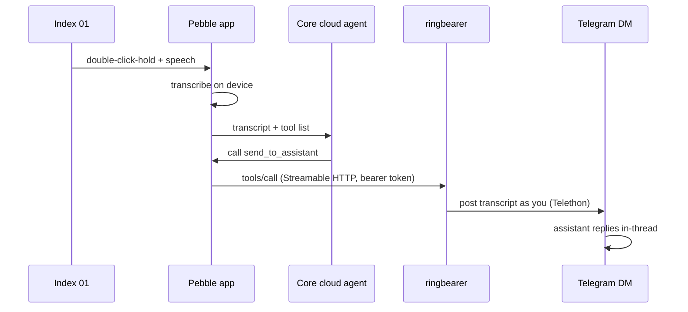

# ringbearer

> *One does not simply type.*

 

Turn the **Pebble Index 01 ring** into a push-to-talk button for your own AI
assistant, using its Telegram DM as the conversation surface.

Double-click-hold the ring and speak. The Pebble app transcribes, its MCP
sandbox agent calls this bridge's one tool, and the bridge posts your words
into your existing Telegram DM with the assistant — **as you, from your own
Telegram account**. By default, the assistant sees a normal message in a
thread it already knows and replies with full context. Optional per-capture
topics start a fresh context instead. Either way, the whole exchange stays
auditable in Telegram like any other conversation. Start something from the
ring on a walk, finish it on your phone later.

Works with any assistant that lives in a Telegram chat: Hermes, OpenClaw, a
bot you wrote yourself — and with several at once, routed by spoken name
("ask plutus…"). One Python file — FastAPI, the MCP SDK, Telethon.

## How it works



The bridge exposes exactly **one MCP tool** — `send_to_assistant` — whose
description tells the app's agent to relay every message verbatim and never
answer itself. Your assistant's actual capabilities are never exposed to the
app's cloud; it just gets a pipe.

## Quick start

```bash
git clone https://github.com/MDB4241/ringbearer && cd ringbearer
python3 -m venv .venv && .venv/bin/pip install -r requirements.txt
.venv/bin/python ringbearer.py
```

That last command is the whole onboarding, one loop: it generates your bearer
token, walks you to [my.telegram.org/apps](https://my.telegram.org/apps) for
API credentials, asks which chat your assistant lives in and where to listen,
writes `.env` (mode 600), logs you into Telegram (one-time), and starts the
server — finishing with the exact settings to paste into the Pebble app. Run
it again any time: it resumes from whatever state exists, which after first
run just means "start the server."

That first server runs in your terminal on purpose — test the ring against it
and watch the tool calls log live. When you're satisfied, Ctrl-C it and
graduate to a real service (next section); the first run prints those exact
steps too.

The pieces also exist standalone when you need one — `ringbearer.py setup`,
`ringbearer.py login` (e.g. after a session revocation), `ringbearer.py run`
(non-interactive by design, so a service manager can never hang on a prompt),
and `ringbearer.py probe`.

A note on Python versions: needs 3.10+, tested on 3.14. The Telegram layer is
[Telethon](https://docs.telethon.dev), pinned exact — its stable 1.x line has
been continuously maintained for about a decade (development now lives on
[Codeberg](https://codeberg.org/Lonami/Telethon); the archived GitHub repo is
a move, not an ending).

Verify without touching your real DM:

```bash
.venv/bin/python ringbearer.py probe           # dry run — exercises auth + MCP + logging
.venv/bin/python ringbearer.py probe --live    # actually sends one real message
```

`probe` connects exactly like the phone would (same transport, same auth), so
it bisects failures: probe succeeds → fix your phone settings; probe fails →
fix server, network, or token. Set `BRIDGE_URL` to probe a remote install.
The probe builds its token from the local config — if the target runs
different settings, point `RINGBEARER_STATE_DIR` at that install's state
directory too.

There is also an offline test suite covering delivery routing, including the
fail-closed topic path — `.venv/bin/python -m unittest` — no network, no
Telegram account involved.

## Phone settings (Pebble app)

Under Index settings → MCP servers:

- **URL:** `http://<host>:8787/ringbearer/mcp` — transport **Streamable**
- **Header:** `Authorization: Bearer <BRIDGE_TOKEN>`
- **Server name: no spaces.** The app sanitizes names for the LLM but
  dispatches tool calls on the original name, so a space breaks the round trip
  with "Invalid tool call" (reported upstream).
- Sandbox group **model type: Default** — the "Index Agent" type ignores
  custom MCP servers.
- Then **Secondary Mode → MCP Sandbox** → select the server group (the OK
  button stays disabled until a group is picked).

## Running it as a service (macOS)

```bash
.venv/bin/python ringbearer.py service            # install + start the launchd agent
.venv/bin/python ringbearer.py service uninstall  # stop + remove it
```

`service` writes the plist with your real paths, creates `logs/`, loads the
agent, and polls `/healthz` until it answers. It also refuses the two classic
traps up front: a checkout under `~/Documents`/`~/Desktop`/`~/Downloads`
(macOS TCC blocks launchd agents from reading those), and a port still held
by a foreground server.

Hand-rollers and Linux users:
[`ringbearer.plist.example`](ringbearer.plist.example) is the equivalent
template, and `ringbearer.py run` under systemd works the same way.

## Docker

Docker support keeps the image disposable and all private state in one
bind-mounted directory. See [`docker/README.md`](docker/README.md) for the
minimal image, Compose example, interactive Telegram login, and deliberate
Tailscale/LAN binding.

## Delivery modes

By default the bridge posts into the ongoing DM conversation: the assistant
sees a normal message in a thread it already knows and replies with full
context. Start something from the ring on a walk, finish it on your phone.

Set `NEW_TOPIC_PER_CAPTURE=true` to create a fresh Telegram topic for every
capture instead — useful for assistants such as Hermes that keep separate
context per topic. The tradeoff: each capture starts a clean conversation,
so the ring only ever opens threads. Follow-ups happen from your phone,
inside the topic the assistant replied in.

Topic mode has Telegram prerequisites — private-chat topics are a Bot API
9.4 feature, off by default. In [@BotFather](https://t.me/BotFather), enable
**Threaded Mode** on your assistant's bot (Bot Settings → Threads Settings)
and keep "users can create topics" allowed. Then in the DM chat itself, tap
the bot's name and flip the **Topics** toggle — it only appears after the
BotFather change (restart Telegram if you don't see it). Topic creation
fails closed: ringbearer logs the capture instead of silently sending it to
another topic.

### One-shot ring context

Normal chat assumes the user can read a reply and answer a follow-up question.
That assumption is wrong when they are walking around speaking into a ring. Set:

```env
DELIVERY_CONTEXT=one_shot
```

Ringbearer then wraps the verbatim transcript in a short recipient-side
instruction explaining that the user may not see the reply. An actionable
request is treated as authorization to act now: the assistant should not ask
for confirmation, should resolve minor ambiguity with reasonable low-risk
defaults, and should report the result briefly. If essential information is
missing, or an action would be materially unsafe or irreversible, it should
leave a concise blocker rather than inventing details or waiting for a live
answer.

The default is `conversation`, which preserves the historical message shape
and normal back-and-forth behaviour. This setting changes only what the target
assistant receives. Captures remain logged verbatim, topic titles still use
the raw transcript, and the Pebble cloud agent remains a relay rather than an
executor.

## Multiple assistants

One bridge can carry to more than one assistant. Map the extras in `.env`:

```
ASSISTANTS=plutus:@plutus_bot,quartermaster:@qm_bot
```

Each entry is `name:chat` — the name a short lowercase token, the chat the
same forms as `ASSISTANT_CHAT`. With any mapping present, the tool grows an
optional `assistant` argument whose schema lists every valid name (the
default assistant included), so the app's agent learns the roster the moment
it connects — nothing to configure on the phone, ever. Say "ask plutus to
check my portfolio" and the capture routes to that chat; say nothing and it
goes to the default.

An unknown name is refused with the valid list, and the capture still lands
in `captures.jsonl` — words are never silently re-routed to a chat you
didn't address. Every mapped chat is verified at startup, and topic mode
applies to all of them: each mapped bot needs the prerequisites above.

Test a mapping without the ring:

```bash
.venv/bin/python ringbearer.py probe --assistant plutus
```

Without `ASSISTANTS` set, none of this exists — the tool keeps its single
`message` argument.

## Network outages

A background supervisor owns the Telegram connection, and Telethon's own
reconnect policy is switched off so that exactly one thing is in charge of it.
When the connection drops, the supervisor retries on exponential backoff: one
second, doubling to a ceiling of one minute, jittered, with no attempt limit and
no give-up. When the link comes back, the next ring press goes through and there
is nothing to restart by hand.

`/healthz` reports what is actually true:

```json
{"ok": true, "telegram": true,
 "connection": {"state": "up", "last_ok_age_s": 4.2, "failed_attempts": 0,
                "next_retry_s": null, "error": null}}
```

`state` is `up`, `down`, `fatal`, or `disabled`, and it comes from the last
completed round trip to Telegram rather than from the socket: a socket reports
healthy while the client underneath is failing to reconnect. **When Telegram is
enabled and unreachable, `/healthz` answers 503**, which the Docker healthcheck
picks up as an unhealthy container with no change to your compose file. Reading
the endpoint never costs a Telegram API call, so an open endpoint cannot be
polled into rate-limit trouble.

`fatal` means Telegram rejected the session: revoked, terminated, or logged out
elsewhere. That is not an outage, so the supervisor stops instead of hiding it
behind a growing retry counter. Run `python ringbearer.py login` again.

## Security notes

- **Your words pass through Pebble's cloud.** The phone transcribes on device,
  but the transcript goes to the app's cloud agent so it can decide to call
  this tool. The bridge is the last hop, not the only one — see the diagram
  above. (A direct webhook mode, [#313](https://github.com/coredevices/mobileapp/issues/313),
  would remove that hop.)
- **Bind deliberately.** Prefer a [Tailscale](https://tailscale.com) address so
  the bridge is reachable from anywhere but never exposed to the LAN or
  internet; WireGuard makes plain HTTP acceptable inside the tailnet. Never
  port-forward this.
- **The bearer token is the gate.** Everything except `/healthz` requires it;
  the server refuses to start without one. Comparison is constant-time. The open
  endpoint carries no captures and no config — only whether Telegram is
  currently reachable.
- **The session file is your Telegram account.** `*.session` is gitignored;
  treat it like a password. One process per session file — a second client on
  the same session risks `AUTH_KEY_DUPLICATED` and revocation.
- **Probes are dry-run by default.** A live probe is a real message your real
  assistant will act on; `--live` is a deliberate flag for that reason.
- **Captures are also logged locally.** Every transcript is appended verbatim
  to `captures.jsonl` (created mode 600, gitignored, never rotated) — it's the
  local record that survives even if Telegram delivery fails. Delete it
  whenever you like.

## Design notes

This is webhook functionality built on MCP. The app's own webhook
mode runs a full agent turn and files every capture as a note, so the MCP
sandbox is the clean path today. There's an upstream feature request for a
direct webhook-only mode
([coredevices/mobileapp#313](https://github.com/coredevices/mobileapp/issues/313));
if it lands, this gets even simpler.

## Configuration

Configuration comes from the process environment and `.env` (see
[`.env.example`](.env.example)). The process environment wins: a variable
already set when the server starts (as the Docker image does for
`BIND_HOST`/`BIND_PORT`) is not overridden by the same key in `.env`:

| Variable | Meaning |
|---|---|
| `BRIDGE_TOKEN` | Bearer token the phone must send (setup generates one) |
| `TELEGRAM_ENABLED` | `true` to actually deliver; `false` = log-only mode |
| `NEW_TOPIC_PER_CAPTURE` | `true` creates a fresh Telegram topic for every capture (default `false`) |
| `DELIVERY_CONTEXT` | Recipient-side handling contract: `conversation` preserves normal chat; `one_shot` tells the assistant to act without waiting for follow-up (default `conversation`) |
| `ASSISTANT_CHAT` | `@botusername` of the assistant DM (recommended; a numeric chat id works only for chats this account's session has already seen — the server verifies at startup) |
| `ASSISTANT_NAME` | Display name the tool description and acks use (`Hermes`); also names the default in the `assistant` enum |
| `ASSISTANTS` | Optional extra assistants, `name:chat` pairs (`plutus:@plutus_bot,qm:@qm_bot`) — adds an `assistant` argument to the tool; see [Multiple assistants](#multiple-assistants) |
| `TG_API_ID` / `TG_API_HASH` | Telegram API credentials (my.telegram.org) |
| `BIND_HOST` / `BIND_PORT` | Listen address — the IP your phone can reach (default port `8787`) |
| `SESSION_NAME` | Telegram session file name (default `ringbearer`) |
| `RING_PREFIX` | Prefix on relayed messages (default 🎤) |
| `MCP_MOUNT` | Mount path; endpoint is `<MCP_MOUNT>/mcp` (default `/ringbearer`) |
| `RINGBEARER_STATE_DIR` | Absolute directory for `.env`, Telegram session files, and captures (process environment only; defaults to this checkout). `service` bakes it into the launchd plist. |

## License

[MIT](LICENSE)
